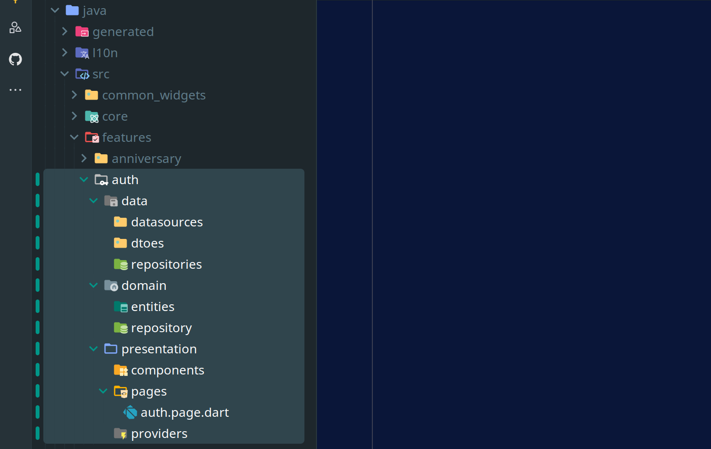

# Folder Structure Generator Plugin

## Overview

Folder Structure Generator is a powerful plugin designed to help developers quickly set up and manage folder structures like Clean Architecture. It allows users to define custom structures using a simple JSON format within the settings panel, making it highly flexible and adaptable to different project architectures.




## Features

- **Multiple Configuration Templates**: Choose from different architecture templates like Clean Architecture, MVC, and more.
- **Customizable Structures**: Define your own folder structures using JSON.
- **User-Friendly Settings Panel**: Modify and manage folder structures with ease.
- **Dynamic File Naming**: Use `$feature` in file names to automatically replace with your feature name.
- **Supports Multiple Architectures**: Adaptable to various architectural patterns.

> For VS Code use [This One](https://marketplace.visualstudio.com/items?itemName=7eltantawy.templagen).

## Installation

1. Open IntelliJ IDEA.
2. Go to `File > Settings > Plugins` (or `IntelliJ IDEA > Preferences > Plugins` on macOS).
3. Search for "Folder Structure Generator" in the Marketplace tab.
4. Click "Install" and restart IntelliJ IDEA when prompted.
5. Once installed, open your project and access the plugin settings in the "Tools" menu to configure your folder structure templates.


## Usage

1. Right click on any folder in your project.
2. Select **Structured Folder** from **New** in the context menu.
3. Choose your desired folder structure template from the submenu.
4. Enter feature name (e.g., "home").

## Dynamic File Naming

You can use the `$feature` variable in your file names, which will be replaced with the feature name you enter. For example:

- If you define a file named `$featurePage` and enter "home" as your feature name, the file will be created as `homePage.dart`.
- This makes it easy to create standardized file naming conventions across your project.

## Multiple Configuration Templates

The plugin now supports multiple configuration templates that you can manage in the settings:

- Switch between different architecture styles (Clean Architecture, MVC, etc.)
- Add your own custom templates
- Edit existing templates to suit your needs
- Select the appropriate template directly from the context menu

## Default Clean Architecture Template

The plugin comes with a predefined Clean Architecture structure. Below is an example JSON configuration:

```json
{
  "domain": {
    "type": "d",
    "children": {
      "repository": { "type": "d" },
      "entities": { "type": "d" }
    }
  },
  "data": {
    "type": "d",
    "children": {
      "datasources": { "type": "d" },
      "dtoes": { "type": "d" },
      "repositories": { "type": "d" }
    }
  },
  "presentation": {
    "type": "d",
    "children": {
      "pages": {
        "type": "d",
        "children": {
          "index": { "type": "f", "ext": "dart" }
        }
      },
      "components": { "type": "d" },
      "providers": { "type": "d" }
    }
  }
}
```

## Customization

You can define your own structures by modifying the JSON configuration. The format follows these rules:

- **Folders**: Defined with `{ "type": "d" }`.
- **Files**: Defined with `{ "type": "f", "ext": "<extension>" }`.
- **Nested Folders**: Use the `children` property to define subdirectories.
- **Dynamic Names**: Use `$feature` in file names for automatic replacement.

Example:

```json
{
  "src": {
    "type": "d",
    "children": {
      "utils": { "type": "d" },
      "$featurePage": { "type": "f", "ext": "dart" }
    }
  }
}
```

## Changelog

### Version 1.2
- **New Feature**: Added support for multiple configuration templates.
- **New Feature**: Added dynamic file naming with the `$feature` variable.
- **Improvement**: Redesigned UI with a configuration submenu.
- **Improvement**: Enhanced settings panel for managing multiple configurations.


## Contributing

1. Fork the repository.
2. Create a new branch (`feature/my-feature`).
3. Commit your changes.
4. Push to the branch.
5. Open a pull request.

## License

This project is licensed under the MIT License.

Copyright (c) 2025 Amin Nezampour

Permission is hereby granted, free of charge, to any person obtaining a copy of this software and associated documentation files, to deal in the Software without restriction, including without limitation the rights to use, copy, modify, merge, publish, distribute, sublicense, and/or sell copies of the Software.

See the [LICENSE.md](./LICENSE.md) file for complete license details.

## Contact

For any issues or feature requests, feel free to open an issue or contact the developer.

[Amin Nezampour](https://aminnez.com/)
